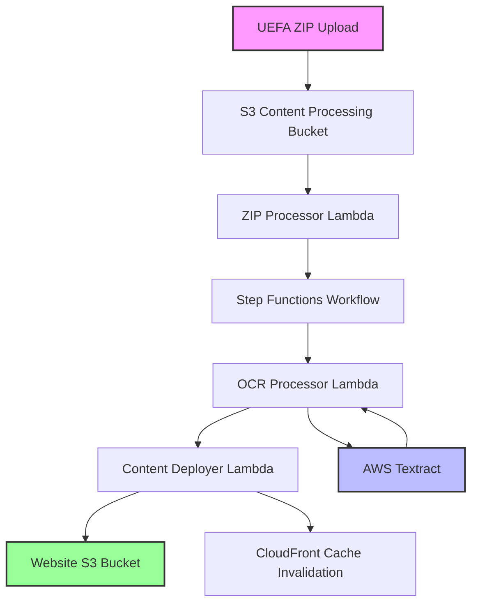

# UEFA RAP Automated Content Processing Pipeline

🚀 **Comprehensive guide for the automated UEFA content processing system**

## Overview

The UEFA RAP Content Processing Pipeline is a serverless solution that automatically processes UEFA ZIP uploads, extracts decision options using OCR, and deploys content to your live website.

## Architecture



## Pipeline Components

### 1. **ZIP Processor Lambda** 🗜️
- **Trigger**: S3 upload event (`.zip` files)
- **Function**: Extracts and validates UEFA ZIP structure
- **Timeout**: 5 minutes
- **Memory**: 512MB

**What it does:**
- Downloads ZIP file from S3
- Validates UEFA structure (videos, images, categories)
- Starts Step Functions workflow
- Provides content summary

### 2. **OCR Processor Lambda** 🔍
- **Function**: Extracts decision options from images using AWS Textract
- **Timeout**: 15 minutes (OCR processing)
- **Memory**: 1024MB

**What it does:**
- Processes decision images with Textract
- Applies category-specific text parsing
- Extracts and cleans decision options
- Builds dictionary structure for quiz functionality

### 3. **Content Deployer Lambda** 🚀
- **Function**: Deploys processed content to website
- **Timeout**: 10 minutes
- **Memory**: 512MB

**What it does:**
- Uploads videos and images to website S3 bucket
- Generates complete `app-clips.json` with OCR results
- Invalidates CloudFront cache
- Returns deployment summary

### 4. **Step Functions Workflow** 🔄
- **Function**: Orchestrates the entire pipeline
- **Features**: Error handling, retries, monitoring

## Supported UEFA Structure

```
UEFA2025-1.zip
├── Resource/
│   ├── medias/
│   │   ├── clips/
│   │   │   ├── A/
│   │   │   │   ├── A1.mp4
│   │   │   │   └── A2.mp4...
│   │   │   ├── B/
│   │   │   └── C/...
│   │   └── images/
│   │       ├── decisions/
│   │       │   ├── A/
│   │       │   │   ├── A1.png
│   │       │   │   └── A2.png...
│   │       │   └── B/...
│   │       └── explanations/
│   │           ├── H/
│   │           └── J/...
│   └── en/
│       ├── 1.xml
│       └── 2.xml...
```

## Category Types

### Quiz Categories (Dictionary-based)
- **A**: Challenges
- **B**: DOGSO-SPA
- **C**: Handball
- **D**: Holding
- **E**: Illegal Use of the Arms
- **F**: Penalty Area Decisions
- **G**: Simulation
- **L**: Offside

### Educational Categories (Translation-based)
- **H**: Advantage
- **J**: Control
- **K**: Dissent
- **M**: Teamwork
- **N**: Laws of the Game

## OCR Decision Extraction

### How it Works
1. **Textract Processing**: AWS Textract extracts text from decision images
2. **Category-Specific Parsing**: Uses predefined patterns for each category
3. **Text Cleaning**: Removes OCR artifacts and normalizes text
4. **Dictionary Generation**: Creates decision options for quiz functionality

### Example Decision Options Extracted

**Category A (Challenges):**
- "no offence"
- "indirect free kick"
- "direct free kick"
- "penalty kick"
- "careless"
- "reckless"
- "violent conduct"

**Category C (Handball):**
- "offence"
- "no offence"
- "ball movement towards hand"
- "hand in natural position"
- "hand in unnatural position"

## Deployment

### Prerequisites
✅ AWS Infrastructure deployed (Phase 1 completed)
✅ Terraform >= 1.0
✅ AWS CLI configured
✅ ZIP support (`zip` command available)

### Deploy the Pipeline

```bash
# 1. Package Lambda functions and deploy infrastructure
cd terraform
./scripts/deploy-dev.sh

# 2. Verify deployment
terraform output
```

### Expected Outputs
```
content_processing_bucket_name = "uefa-rap-content-processing-dev"
step_functions_arn = "arn:aws:states:us-east-1:777864510236:stateMachine:uefa-rap-content-processing-dev"
zip_processor_lambda_name = "uefa-rap-zip-processor-dev"
ocr_processor_lambda_name = "uefa-rap-ocr-processor-dev"
content_deployer_lambda_name = "uefa-rap-content-deployer-dev"
website_url = "https://dev.uefa-rap.com"
```

## Usage

### Upload UEFA Content

```bash
# Upload UEFA ZIP file to trigger processing
aws s3 cp UEFA2025-1.zip s3://uefa-rap-content-processing-dev/

# Monitor Step Functions execution
aws stepfunctions list-executions \
  --state-machine-arn "arn:aws:states:us-east-1:777864510236:stateMachine:uefa-rap-content-processing-dev"
```

### Via AWS Console
1. **Go to S3** → `uefa-rap-content-processing-dev` bucket
2. **Upload** your UEFA ZIP file
3. **Monitor** Step Functions execution in AWS Console
4. **Check** your website for updated content

## Monitoring & Debugging

### CloudWatch Logs
- **ZIP Processor**: `/aws/lambda/uefa-rap-zip-processor-dev`
- **OCR Processor**: `/aws/lambda/uefa-rap-ocr-processor-dev`
- **Content Deployer**: `/aws/lambda/uefa-rap-content-deployer-dev`

### Step Functions Console
- **View executions**: AWS Console → Step Functions → `uefa-rap-content-processing-dev`
- **Monitor progress**: Real-time execution graph
- **Debug failures**: Error details and retry attempts

### Common Issues & Solutions

**1. ZIP Structure Validation Failed**
```
Solution: Ensure ZIP follows UEFA structure exactly
- Check file paths match expected format
- Verify all required directories exist
```

**2. OCR Processing Timeout**
```
Solution: Large image sets may need longer timeout
- Check image file sizes
- Consider splitting large uploads
```

**3. CloudFront Invalidation Slow**
```
Normal: CloudFront invalidation takes 5-15 minutes
- Content will update gradually across CDN
- Check invalidation status in CloudFront console
```

## Generated Content Structure

### app-clips.json Format
```json
{
  "dictionary": {
    "A": {
      "no offence": "",
      "indirect free kick": "",
      "direct free kick": "",
      "penalty kick": ""
    }
  },
  "A": {
    "letter": "A",
    "category": "Challenges",
    "dictionary": true,
    "content": [
      {
        "id": 0,
        "video": "https://dev.uefa-rap.com/UEFA2025-1/Resource/medias/clips/A/A1.mp4",
        "thumbnail": "https://dev.uefa-rap.com/UEFA2025-1/Resource/medias/th/A/A1.png",
        "decision": "https://dev.uefa-rap.com/UEFA2025-1/Resource/medias/images/decisions/A/A1.png"
      }
    ]
  }
}
```

## Cost Optimization

### AWS Free Tier Usage
- **Lambda**: 1M requests/month, 400K GB-seconds
- **Step Functions**: 4K state transitions/month
- **Textract**: 1K pages/month
- **S3**: 5GB storage, 20K GET requests
- **CloudFront**: 50GB data transfer

### Estimated Costs (Beyond Free Tier)
- **Textract**: ~$0.0015 per page (decision image)
- **Lambda**: ~$0.0000166 per GB-second
- **Step Functions**: ~$0.025 per 1K transitions
- **S3**: ~$0.023 per GB storage

**Typical UEFA Package**: ~$0.50-2.00 per processing run

## Performance Metrics

### Expected Processing Times
- **Small Package** (1-2 categories): 3-5 minutes
- **Medium Package** (5-8 categories): 8-12 minutes  
- **Large Package** (10+ categories): 15-20 minutes

### Bottlenecks
1. **OCR Processing**: Most time-consuming step
2. **CloudFront Invalidation**: Cache update time
3. **Large File Uploads**: Network transfer time

## Security Features

### IAM Least Privilege
- Lambda functions have minimal required permissions
- S3 bucket policies restrict access
- Step Functions role limited to Lambda invocation

### Data Protection
- All S3 buckets encrypted at rest (AES256)
- CloudWatch logs retention configured
- No sensitive data logged

## Future Enhancements

### Phase 3 Roadmap
- [ ] **Thumbnail Generation**: Automatic video thumbnails
- [ ] **Multi-language Support**: Process multiple language packs
- [ ] **Content Versioning**: Track and rollback content versions
- [ ] **Batch Processing**: Handle multiple ZIP files simultaneously
- [ ] **Advanced OCR**: Custom ML models for better accuracy

### Integration Opportunities  
- [ ] **Slack/Teams Notifications**: Processing status updates
- [ ] **Email Reports**: Detailed processing summaries
- [ ] **API Endpoints**: Programmatic content management
- [ ] **Content Analytics**: Usage tracking and insights

## Support & Maintenance

### Regular Maintenance
- **Monitor costs**: Review AWS billing monthly
- **Update Lambda runtimes**: Keep Python version current
- **Review logs**: Check for processing errors
- **Test uploads**: Validate pipeline with sample data

### Backup & Recovery
- **S3 versioning enabled**: Content processing bucket
- **Terraform state**: Backed up in S3 with encryption
- **Lambda source code**: Version controlled in Git

## Troubleshooting Commands

```bash
# Check Lambda function logs
aws logs tail /aws/lambda/uefa-rap-zip-processor-dev --follow

# List Step Functions executions
aws stepfunctions list-executions \
  --state-machine-arn $(terraform output -raw step_functions_arn)

# Check S3 bucket contents
aws s3 ls s3://$(terraform output -raw content_processing_bucket_name)/ --recursive

# Validate website deployment
curl -I $(terraform output -raw website_url)/app-clips.json

# Check CloudFront invalidation status
aws cloudfront list-invalidations \
  --distribution-id $(terraform output -raw cloudfront_distribution_id)
```

## Success Criteria ✅

- [x] **Automated ZIP Processing**: Upload triggers immediate processing
- [x] **OCR Decision Extraction**: Text extracted from images accurately  
- [x] **Content Deployment**: Files uploaded to website automatically
- [x] **Cache Invalidation**: CloudFront cache cleared for immediate updates
- [x] **Error Handling**: Retries and failure notifications
- [x] **Cost Optimization**: AWS Free Tier friendly
- [x] **Monitoring**: CloudWatch logs and Step Functions visibility

---

🎉 **Your UEFA RAP Content Processing Pipeline is ready!**

Simply upload a UEFA ZIP file to your S3 bucket and watch the magic happen. The entire process from upload to live website deployment is now fully automated.
